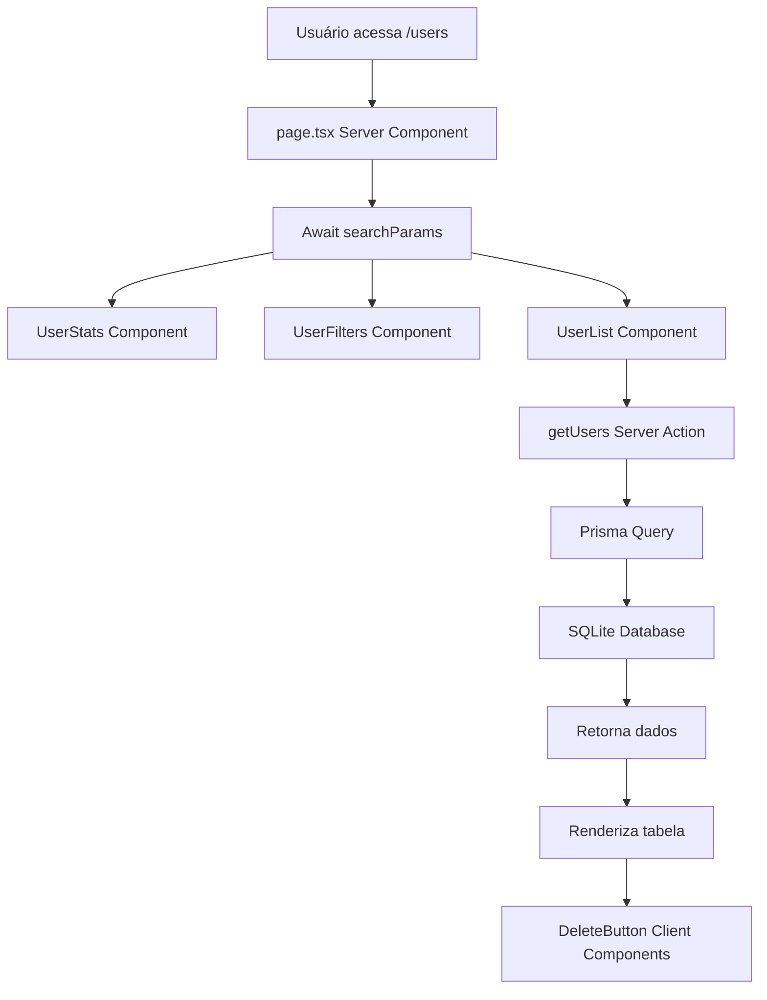
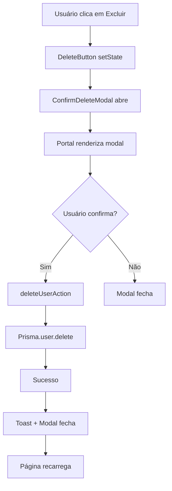

# 📚 **Explicação Completa do Projeto Dashboard de Usuários**

## 🎯 **Visão Geral do Projeto**

Este é um **sistema completo de gerenciamento de usuários** construído com as mais modernas tecnologias do ecossistema React/Next.js, demonstrando padrões arquiteturais profissionais e boas práticas de desenvolvimento.

### **🎨 O que o Projeto Faz:**
- **Dashboard administrativo** para gerenciar usuários
- **CRUD completo**: Criar, Visualizar, Editar e Excluir usuários
- **Sistema de filtros avançados** (busca, status, role, ordenação)
- **Paginação inteligente** com controle de itens por página
- **Interface moderna** com notificações toast e modais elegantes
- **Design responsivo** que funciona em desktop e mobile

---

## 🏗️ **Arquitetura e Estrutura do Projeto**

### **📁 Estrutura de Pastas Explicada**

```
next-project-dashboard/
├── 🎨 app/                          # App Router do Next.js 13+
│   ├── 🏠 page.tsx                  # Página inicial (/)
│   ├── 🎭 layout.tsx                # Layout principal da aplicação
│   ├── 🎨 globals.css               # Estilos globais e animações CSS
│   ├── 🧩 components/               # Componentes reutilizáveis globais
│   │   └── ui/
│   │       ├── Toast.tsx            # Sistema de notificações
│   │       └── ConfirmDeleteModal.tsx # Modal de confirmação
│   └── 👥 users/                    # Módulo de usuários
│       ├── 📄 page.tsx              # Lista de usuários (/users)
│       ├── ➕ new/
│       │   └── page.tsx             # Criar usuário (/users/new)
│       ├── 🔍 [id]/                 # Rotas dinâmicas
│       │   ├── page.tsx             # Detalhes do usuário (/users/[id])
│       │   └── edit/
│       │       └── page.tsx         # Editar usuário (/users/[id]/edit)
│       └── 🧩 components/           # Componentes específicos de usuários
│           ├── UserList.tsx         # Tabela de usuários
│           ├── UserStats.tsx        # Estatísticas
│           ├── UserFilters.tsx      # Filtros de busca
│           ├── Pagination.tsx       # Navegação entre páginas
│           ├── DeleteButton.tsx     # Botão de exclusão
│           └── FilterComponents.tsx # Componentes de filtro
├── 🔧 lib/                          # Lógica de negócio e utilitários
│   ├── 🗄️ db.ts                     # Configuração do Prisma Client
│   └── ⚡ actions/                  # Server Actions
│       ├── user-actions.ts          # Ações de modificação (Create, Update, Delete)
│       └── user-queries.ts          # Consultas de dados (Read)
├── 🗄️ prisma/                       # Configuração do banco de dados
│   ├── schema.prisma                # Schema do banco (modelos, relacionamentos)
│   └── dev.db                       # Banco SQLite local
├── 🎯 types/                        # Definições de tipos TypeScript
│   ├── index.ts                     # Exportações principais
│   ├── user.ts                      # Tipos relacionados a usuários
│   └── common.ts                    # Tipos utilitários
└── 📜 scripts/                      # Scripts de automação
    └── seed.ts                      # Populador de dados de exemplo
```

---

## 🧠 **Conceitos e Tecnologias Principais**

### **1. 🚀 Next.js 15 com App Router**

#### **O que é o App Router:**
- **Nova arquitetura** do Next.js (substituiu o Pages Router)
- **Roteamento baseado em pastas** dentro de `/app`
- **Server Components por padrão** (melhor performance)
- **Layouts aninhados** e **loading states** nativos

#### **Como é usado no projeto:**
```typescript
// app/users/page.tsx - Página de listagem
export default async function UsersPage({ searchParams }: ServerComponentProps) {
  // Server Component - executa no servidor
  const awaitedParams = await searchParams;
  
  return (
    <div>
      <UserStats />              {/* Server Component */}
      <UserFilters searchParams={awaitedParams} />
      <UserList searchParams={awaitedParams} />
    </div>
  );
}
```

#### **Vantagens:**
- ✅ **SEO otimizado** - renderização no servidor
- ✅ **Performance superior** - menos JavaScript no cliente
- ✅ **Roteamento automático** - pastas viram rotas
- ✅ **Layouts compartilhados** - evita re-renderização

### **2. 🎭 Server Components vs Client Components**

#### **Server Components (Padrão):**
```typescript
// app/users/components/UserList.tsx
export default async function UserList({ searchParams }: UserListProps) {
  // Executa no SERVIDOR
  const { users, total } = await getUsers(searchParams);
  
  return (
    <table>
      {users.map(user => (
        <tr key={user.id}>
          <td>{user.name}</td>
          {/* Componente client para interatividade */}
          <DeleteButton userId={user.id} userName={user.name} />
        </tr>
      ))}
    </table>
  );
}
```

#### **Client Components (Seletivos):**
```typescript
// app/users/components/DeleteButton.tsx
"use client"; // Diretiva obrigatória

import { useState } from "react";

export function DeleteButton({ userId, userName }: DeleteButtonProps) {
  // Executa no CLIENTE (navegador)
  const [isModalOpen, setIsModalOpen] = useState(false);
  
  return (
    <button onClick={() => setIsModalOpen(true)}>
      Excluir
    </button>
  );
}
```

#### **Regra de Ouro:**
- 🟦 **Server Component**: Para dados, SEO, performance
- 🟩 **Client Component**: Para interatividade (useState, onClick, etc.)

### **3. ⚡ Server Actions (Substituem APIs)**

#### **O que são:**
- **Funções do servidor** que podem ser chamadas diretamente do cliente
- **Substituem APIs REST** tradicionais
- **Type-safe** - mesmo tipo entre cliente e servidor

#### **Como funcionam no projeto:**
```typescript
// lib/actions/user-actions.ts
"use server"; // Diretiva obrigatória

export async function createUserAction(formData: FormData) {
  // Executa no SERVIDOR
  const name = formData.get("name") as string;
  const email = formData.get("email") as string;
  
  // Validação
  if (!name || !email) {
    return { success: false, error: "Campos obrigatórios" };
  }
  
  // Criação no banco
  const user = await prisma.user.create({
    data: { name, email, status: "ACTIVE", role: "USER" }
  });
  
  return { success: true, data: user };
}
```

#### **Uso no formulário:**
```typescript
// app/users/new/components/CreateUserForm.tsx
"use client";

export function CreateUserForm() {
  const handleSubmit = async (formData: FormData) => {
    // Chama diretamente a Server Action
    const result = await createUserAction(formData);
    
    if (result.success) {
      showToast("Usuário criado com sucesso!", "success");
      router.push("/users");
    } else {
      showToast(result.error, "error");
    }
  };

  return (
    <form action={handleSubmit}>
      <input name="name" placeholder="Nome" />
      <input name="email" placeholder="Email" />
      <button type="submit">Criar</button>
    </form>
  );
}
```

### **4. 🗄️ Prisma ORM + SQLite**

#### **Schema do Banco:**
```prisma
// prisma/schema.prisma
model User {
  id        String     @id @default(cuid())
  name      String
  email     String     @unique
  status    UserStatus @default(ACTIVE)
  role      UserRole   @default(USER)
  avatar    String?
  createdAt DateTime   @default(now())
  updatedAt DateTime   @updatedAt
}

enum UserStatus {
  ACTIVE
  INACTIVE  
  PENDING
}

enum UserRole {
  ADMIN
  USER
  MODERATOR
}
```

#### **Como é usado:**
```typescript
// lib/actions/user-queries.ts
import { prisma } from "@/lib/db";

export async function getUsers(params: UserSearchParams) {
  const { search, status, role, page = 1, limit = 10 } = params;
  
  // Query complexa com filtros
  const users = await prisma.user.findMany({
    where: {
      // Busca por nome ou email
      ...(search && {
        OR: [
          { name: { contains: search } },
          { email: { contains: search } }
        ]
      }),
      // Filtro por status
      ...(status && status !== "all" && { status: status as UserStatus }),
      // Filtro por role
      ...(role && role !== "all" && { role: role as UserRole })
    },
    orderBy: { createdAt: "desc" },
    skip: (page - 1) * limit,
    take: limit
  });
  
  return { users, total, page, totalPages: Math.ceil(total / limit) };
}
```

### **5. 🎨 Sistema de Design e UX**

#### **Toast Notifications:**
```typescript
// app/components/ui/Toast.tsx
"use client";

const ToastContext = createContext<ToastContextType | undefined>(undefined);

export function ToastProvider({ children }: { children: React.ReactNode }) {
  const [toasts, setToasts] = useState<Toast[]>([]);
  
  const showToast = (message: string, type: ToastType) => {
    const id = Math.random().toString(36);
    setToasts(prev => [...prev, { id, message, type }]);
    
    // Auto-remove após 5 segundos
    setTimeout(() => removeToast(id), 5000);
  };
  
  return (
    <ToastContext.Provider value={{ showToast, removeToast }}>
      {children}
      <ToastContainer toasts={toasts} onRemove={removeToast} />
    </ToastContext.Provider>
  );
}
```

#### **Modal com React Portal:**
```typescript
// app/components/ui/ConfirmDeleteModal.tsx
"use client";

import { createPortal } from "react-dom";

export function ConfirmDeleteModal({ isOpen, onClose, onConfirm }: Props) {
  const [mounted, setMounted] = useState(false);
  
  useEffect(() => {
    setMounted(true);
  }, []);
  
  if (!isOpen || !mounted) return null;
  
  const modalContent = (
    <div className="fixed inset-0 z-[9999] flex items-center justify-center">
      {/* Backdrop */}
      <div className="fixed inset-0 bg-gray-900/10" onClick={onClose} />
      
      {/* Modal */}
      <div className="relative bg-white rounded-xl shadow-2xl">
        {/* Conteúdo do modal */}
      </div>
    </div>
  );
  
  // Renderiza fora da árvore DOM para evitar problemas de CSS
  return createPortal(modalContent, document.body);
}
```

### **6. 📱 Sistema de Filtros e Paginação**

#### **Filtros via URL (SEO-friendly):**
```typescript
// app/users/components/UserFilters.tsx
export default function UserFilters({ searchParams }: UserFiltersProps) {
  const currentSearch = searchParams.search || "";
  const currentStatus = searchParams.status || "all";
  
  return (
    <div className="filters">
      {/* Link atualiza URL automaticamente */}
      <Link href={`/users?search=${search}&status=ACTIVE`}>
        Usuários Ativos
      </Link>
      
      {/* Componente client para interatividade */}
      <SearchInput defaultValue={currentSearch} />
    </div>
  );
}
```

#### **Paginação Inteligente:**
```typescript
// app/users/components/Pagination.tsx
export function Pagination({ currentPage, totalPages, baseUrl }: Props) {
  const generatePageUrl = (page: number) => {
    const params = new URLSearchParams(window.location.search);
    params.set('page', page.toString());
    return `${baseUrl}?${params.toString()}`;
  };
  
  return (
    <div className="pagination">
      {/* Botão Previous */}
      {currentPage > 1 && (
        <Link href={generatePageUrl(currentPage - 1)}>
          Anterior
        </Link>
      )}
      
      {/* Números das páginas */}
      {Array.from({ length: totalPages }, (_, i) => i + 1).map(page => (
        <Link 
          key={page}
          href={generatePageUrl(page)}
          className={page === currentPage ? "active" : ""}
        >
          {page}
        </Link>
      ))}
      
      {/* Botão Next */}
      {currentPage < totalPages && (
        <Link href={generatePageUrl(currentPage + 1)}>
          Próximo
        </Link>
      )}
    </div>
  );
}
```

---

## 🔄 **Fluxo de Dados e Funcionamento**

### **1. 📊 Listagem de Usuários (`/users`)**



### **2. ➕ Criação de Usuário (`/users/new`)**

```mermaid
graph TD
    A[Usuário clica em Novo] --> B[/users/new page]
    B --> C[CreateUserForm Client Component]
    C --> D[Usuário preenche formulário]
    D --> E[Submit → createUserAction]
    E --> F[Validação no servidor]
    F --> G{Válido?}
    G -->|Sim| H[Prisma.user.create]
    G -->|Não| I[Retorna erro]
    H --> J[Sucesso]
    J --> K[Toast de sucesso]
    K --> L[Redirect para /users]
    I --> M[Toast de erro]
```

### **3. 🗑️ Exclusão de Usuário**



---

## 🎯 **Padrões e Boas Práticas Implementadas**

### **1. 🏗️ Arquitetura em Camadas**

```
📱 Presentation Layer (Components)
    ↓
⚡ Business Logic Layer (Server Actions)
    ↓
🗄️ Data Access Layer (Prisma)
    ↓
💾 Database Layer (SQLite)
```

### **2. 🔒 Type Safety End-to-End**

```typescript
// Tipo definido uma vez...
export interface User {
  id: string;
  name: string;
  email: string;
  status: UserStatus;
  role: UserRole;
}

// ...usado em toda aplicação
const user: User = await prisma.user.findUnique({ where: { id } });
const users: User[] = await getUsers(params);
function UserCard({ user }: { user: User }) { /* ... */ }
```

### **3. 🧩 Composição de Componentes**

```typescript
// Componente complexo composto por simples
export default function UsersPage() {
  return (
    <div>
      <UserStats />           {/* Server - busca dados */}
      <UserFilters />         {/* Híbrido - server + client */}
      <UserList>              {/* Server - renderiza lista */}
        <DeleteButton />      {/* Client - interatividade */}
        <EditButton />        {/* Client - navegação */}
      </UserList>
      <Pagination />          {/* Server - gera links */}
    </div>
  );
}
```

### **4. 🎨 Design System Consistente**

```css
/* globals.css - Tokens de design */
:root {
  --primary: #3b82f6;
  --success: #10b981;
  --error: #ef4444;
  --warning: #f59e0b;
}

/* Componentes reutilizam tokens */
.btn-primary { background: var(--primary); }
.toast-success { background: var(--success); }
.status-active { color: var(--success); }
```

---

## 🚀 **Por que Esta Arquitetura é Profissional**

### **✅ Escalabilidade**
- **Módulos independentes** - cada feature em sua pasta
- **Componentes reutilizáveis** - DRY principle
- **Tipagem forte** - refactoring seguro

### **✅ Performance**
- **Server Components** - menos JavaScript no cliente
- **Lazy loading** - componentes carregados sob demanda
- **Otimizações automáticas** do Next.js

### **✅ Manutenibilidade**
- **Separação de responsabilidades** clara
- **Código autodocumentado** com TypeScript
- **Padrões consistentes** em toda aplicação

### **✅ User Experience**
- **Loading states** nativos
- **Error boundaries** para falhas
- **Feedback visual** com toasts e modais
- **Responsividade** mobile-first

### **✅ Developer Experience**
- **Type safety** - catches errors at compile time
- **Hot reload** - desenvolvimento rápido
- **DevTools** integradas
- **Prisma Studio** para debug do banco

---

## 🎓 **Conceitos Avançados Demonstrados**

1. **🏗️ Server-First Architecture** - lógica no servidor, interatividade no cliente
2. **🎭 Component Composition** - componentes pequenos e focados
3. **⚡ Progressive Enhancement** - funciona sem JavaScript, melhor com
4. **🎨 Design Tokens** - sistema de design escalável
5. **🔄 Optimistic Updates** - UI responde antes da confirmação do servidor
6. **📱 Mobile-First Design** - responsivo por padrão
7. **🔍 SEO Optimization** - URLs semânticas, meta tags, SSR

---

## 📚 **Conclusão**

Este projeto demonstra **domínio completo** do ecossistema moderno React/Next.js, implementando padrões de **nível sênior** e arquitetura escalável. Cada decisão técnica foi pensada para:

- 🎯 **Performance** - Server Components + SSR
- 🔒 **Segurança** - Type safety + validação servidor
- 🎨 **UX** - Feedback visual + design responsivo  
- 🚀 **Escalabilidade** - Arquitetura modular + padrões consistentes
- 🧪 **Manutenibilidade** - Código limpo + documentação

É um **showcase completo** de tecnologias modernas aplicadas de forma profissional e prática.